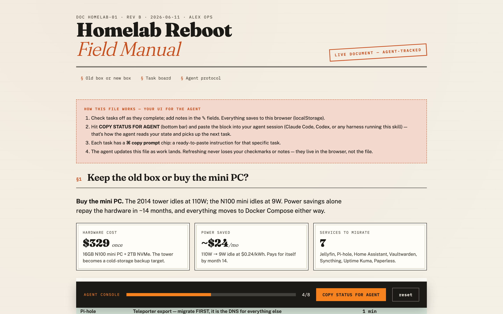
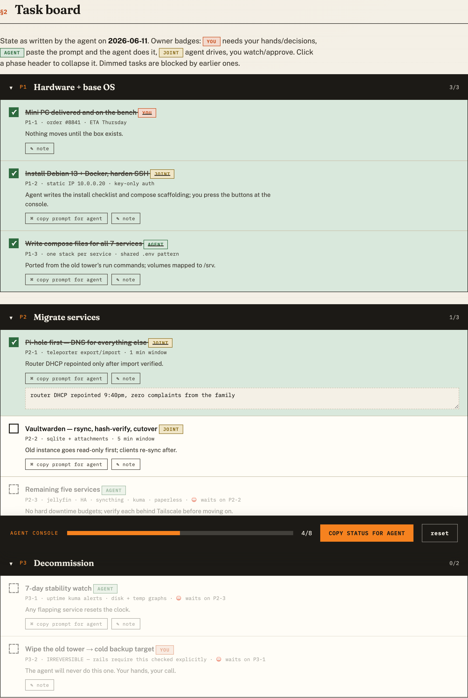

# field-manual

**A single HTML file that is your UI for your coding agent.**

`field-manual` is a Claude Code skill that turns any project into an interactive *field manual*: researched decisions up top, an owner-badged task board below, and a sync loop that lets you and your agent share state through one file — no server, no database, no extension.



## Why

Agent sessions end. Projects don't. The usual fix is a pile of markdown TODOs that neither you nor the agent actually reads back.

A field manual is different because it runs in both directions:

- **The agent writes it** — researched decision sections (with verify-dates and sources) and a task board it keeps current as work lands.
- **You live in it** — check tasks off, jot notes, collapse phases. Your state persists in the browser (localStorage), so the agent updating the file never clobbers your checkmarks.
- **One button closes the loop** — **COPY STATUS FOR AGENT** produces a markdown block; paste it into any session and the agent reconciles: reads your notes, does the next tasks it owns, ships a new revision of the file.
- **Every task is one click from delegation** — the ⌘ chip copies a self-contained prompt (doc ID, task id, paths included) so a fresh session needs zero context.



## Install

Claude Code, via the plugin system:

```bash
claude plugin marketplace add saucy-tech/field-manual
claude plugin install field-manual@field-manual
```

Or manual (any harness that reads `skills/`):

```bash
cd ~/.claude/skills
git clone https://github.com/saucy-tech/field-manual
```

## Use

```
> make a field manual for this project
```

The agent researches first (a manual ships conclusions, not placeholders), fills the template, and opens the file. From then on:

| You do | Agent does |
|---|---|
| Check boxes, write notes | — |
| Click **COPY STATUS FOR AGENT**, paste into a session | Reconciles: your paste is ground truth, `NOTE:` lines are instructions, next agent-owned tasks get done, file revs |
| Click a task's **⌘ copy prompt** chip, paste | That one task, nothing else |

### Owner badges and rails

Every task is owned: **you** (decisions, credentials — the agent never auto-executes these), **agent** (one paste away), or **joint** (agent drives, you supply inputs). Destructive actions get their own explicit go-task; until you check it, the agent won't act. `blockedBy` dependencies render blocked tasks dimmed and disabled.

## Try the demo

Open [`demo/demo.html`](demo/demo.html) in a browser — a fictional homelab migration with all the mechanics live: collapsible phases, blocked tasks, notes, the status-sync button.

## Format

The full contract is in [`skills/field-manual/references/format.md`](skills/field-manual/references/format.md): the doc ID doubles as the localStorage key (immutable), task ids are append-only, the `TASKS` array is the only thing the agent edits on reconcile, and the design system (Fraunces / Public Sans / IBM Plex Mono on paper-and-ink) is locked so every manual feels like the same instrument.

## Origin

Built mid-flight during a real Vercel→Cloudflare migration: five repos, two production domains, too many "wait, what's left?" moments. The first manual ran the rest of that migration; this repo is that pattern, generalized.

## License

MIT
